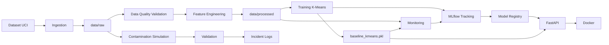

# Wholesale Customers MLOps

Proyecto de MLOps para la segmentación de clientes mayoristas utilizando el conjunto de datos **Wholesale Customers**. El proyecto integra ingesta de datos, validación de calidad, transformación de características, entrenamiento de un modelo de clustering, seguimiento con MLflow, registro del modelo, API REST con FastAPI, Docker, pruebas automatizadas y monitoreo.

---

## 1. Problema de negocio

Las empresas mayoristas manejan clientes con diferentes patrones de consumo. Identificar grupos de clientes con comportamientos similares permite apoyar decisiones relacionadas con segmentación, estrategias comerciales y análisis de consumo.

El objetivo de este proyecto es desarrollar una solución reproducible de Machine Learning que permita:

* Procesar automáticamente los datos.
* Validar su calidad antes del entrenamiento.
* Transformar las variables para el modelo.
* Segmentar clientes mediante clustering.
* Registrar y versionar el modelo.
* Exponer predicciones mediante una API.
* Monitorear cambios en los datos y estabilidad del modelo.
* Detectar contaminación de datos antes de utilizar un batch en producción.

---

## 2. Dataset

Se utiliza el conjunto de datos **Wholesale Customers**, que contiene información sobre clientes mayoristas.

El dataset contiene **440 registros y 8 variables**:

| Variable         | Descripción                              |
| ---------------- | ---------------------------------------- |
| Channel          | Canal de venta                           |
| Region           | Región                                   |
| Fresh            | Gasto anual en productos frescos         |
| Milk             | Gasto anual en productos lácteos         |
| Grocery          | Gasto anual en productos de supermercado |
| Frozen           | Gasto anual en productos congelados      |
| Detergents_Paper | Gasto anual en detergentes y papel       |
| Delicassen       | Gasto anual en productos delicatessen    |

Para el modelo se utilizan las seis variables de gasto:

* Fresh
* Milk
* Grocery
* Frozen
* Detergents_Paper
* Delicassen

Las variables `Channel` y `Region` no se utilizan directamente para el clustering.

El dataset original se descarga mediante el proceso de ingesta y se almacena localmente en:

```text
data/raw/wholesale_customers.csv
```

El dataset original **no se incluye en Git**, ya que está excluido mediante `.gitignore`.

---

## 3. Arquitectura MLOps

La solución implementa un flujo desde la ingesta de datos hasta el consumo del modelo mediante una API.



### Flujo principal

```text
Dataset
   ↓
Ingestion
   ↓
Data Quality
   ↓
Feature Engineering
   ↓
Training
   ↓
MLflow
   ↓
Model Registry
   ↓
FastAPI
   ↓
Docker
```

El monitoreo se ejecuta de forma independiente para comparar los datos de referencia con los datos actuales y evaluar la estabilidad del modelo.

---

## 4. Estructura del repositorio

```text
wholesale-customers-mlops/
│
├── data/
│   ├── raw/
│   │   └── wholesale_customers.csv
│   │
│   └── processed/
│       ├── wholesale_customers_current.csv
│       └── wholesale_customers_scaled.csv
│
├── models/
│   ├── baseline_kmeans.pkl
│   └── feature_pipeline.pkl
│
├── notebooks/
│   ├── 01_eda_clustering.ipynb
│   └── 02_clustering_evaluation.ipynb
│
├── src/
│   ├── api/
│   │   └── main.py
│   │
│   ├── features/
│   │   └── ...
│   │
│   ├── ingestion/
│   │   └── ingest.py
│   │
│   ├── monitoring/
│   │   └── monitoring.py
│   │
│   ├── training/
│   │   └── train.py
│   │
│   └── validation/
│       ├── data_quality.py
│       └── contamination_simulation.py
│
├── tests/
│   ├── test_api.py
│   └── test_data.py
│
├── logs/
│   └── contamination_incidents.json
│
├── Dockerfile
├── pytest.ini
├── requirements.txt
├── README.md
└── .gitignore
```

---

## 5. Instalación

### Requisitos

* Python 3.11+
* Git
* Docker Desktop
* MLflow

### Clonar el repositorio

```bash
git clone https://github.com/Sharvial/wholesale-customers-mlops.git
cd wholesale-customers-mlops
```

### Instalar dependencias

```bash
pip install -r requirements.txt
```

---

## 6. Ingesta de datos

La ingesta está implementada en:

```text
src/ingestion/ingest.py
```

Para ejecutar la ingesta:

```bash
python src/ingestion/ingest.py
```

Resultado esperado:

```text
Dataset descargado exitosamente.
Guardado en: data/raw\wholesale_customers.csv
Dimensiones iniciales: (440, 8)
```

El proceso permite reproducir la obtención del dataset sin depender de una carga manual.

---

## 7. Calidad de datos

La validación se implementa en:

```text
src/validation/data_quality.py
```

Se utilizan diferentes reglas automáticas para evitar que datos inválidos continúen hacia el entrenamiento.

### Gates implementados

1. Verificación de cantidad mínima de registros.
2. Verificación de valores faltantes.
3. Verificación de porcentaje de duplicados.
4. Verificación de valores negativos en variables de gasto.
5. Verificación de tipos numéricos.

Si una validación crítica falla, el proceso genera un error y evita continuar.

---

## 8. EDA

El análisis exploratorio se desarrolla en los notebooks:

```text
notebooks/01_eda_clustering.ipynb
notebooks/02_clustering_evaluation.ipynb
```

El análisis permite estudiar:

* Distribución de las variables.
* Escala de los datos.
* Relación entre variables.
* Comportamiento de los clientes.
* Número de clusters.
* Métricas de evaluación del clustering.

El EDA sirve como base para las decisiones de transformación y modelado.

---

## 9. Feature Engineering

El procesamiento de características se realiza mediante un pipeline reutilizable.

Se aplican:

1. Selección de las variables de gasto.
2. Transformación `log1p`.
3. Escalamiento robusto mediante `RobustScaler`.

Las variables finales utilizadas por el modelo son:

```text
Fresh
Milk
Grocery
Frozen
Detergents_Paper
Delicassen
```

El pipeline se guarda como:

```text
models/feature_pipeline.pkl
```

Esto permite aplicar las mismas transformaciones durante el entrenamiento y posteriormente durante el consumo del modelo.

---

## 10. Entrenamiento

El entrenamiento está implementado en:

```text
src/training/train.py
```

Se utiliza:

```text
Algoritmo: K-Means
Número de clusters: 3
Random state: 42
n_init: 10
```

El modelo entrenado se guarda como:

```text
models/baseline_kmeans.pkl
```

### Resultados

| Métrica              | Resultado |
| -------------------- | --------: |
| Silhouette Score     |  0.243647 |
| Davies-Bouldin Score |  1.321060 |
| Inertia              |  953.9330 |
| Clusters             |         3 |

Para seleccionar el mejor candidato se utiliza como criterio principal el **mayor Silhouette Score** y como criterio secundario el **menor Davies-Bouldin Score**.

---

## 11. MLflow Tracking

El seguimiento de experimentos se realiza mediante MLflow.

Experimento:

```text
wholesale-customers-clustering
```

Se registran parámetros como:

* Algoritmo.
* Número de clusters.
* `random_seed`.
* `n_init`.
* `feature_set`.
* `data_version`.
* Criterio de selección.

También se registran métricas como:

* Silhouette Score.
* Davies-Bouldin Score.
* Inertia.
* Resultados de monitoreo.

Los modelos y resultados relevantes se almacenan como artefactos.

Para iniciar el servidor local:

```bash
mlflow server
```

El servidor se ejecuta en:

```text
http://127.0.0.1:5000
```

---

## 12. Model Registry

El modelo se registra en MLflow Model Registry como:

```text
WholesaleCustomersKMeans
```

Versión actual:

```text
1
```

Se utilizan referencias de ciclo de vida:

```text
candidate
validation
production
```

Además, la versión validada contiene:

```text
lifecycle_stage = Production
validation_status = passed
```

### Criterio de selección

El candidato se selecciona mediante:

1. Mayor Silhouette Score.
2. Menor Davies-Bouldin Score como criterio secundario.

Esto permite establecer una regla explícita para seleccionar el modelo que continúa hacia las siguientes etapas.

---

## 13. Docker

La API está contenerizada mediante Docker.

El proyecto incluye:

```text
Dockerfile
```

### Construcción de la imagen

```bash
docker build -t wholesale-customers-api .
```

### Ejecución

```bash
docker run -p 8000:8000 wholesale-customers-api
```

La API queda disponible en:

```text
http://127.0.0.1:8000
```

La imagen fue probada exitosamente mediante los endpoints de salud y predicción.

---

## 14. API FastAPI

La API está implementada en:

```text
src/api/main.py
```

Framework utilizado:

```text
FastAPI
```

### Endpoint `/health`

Método:

```text
GET
```

Respuesta:

```json
{
  "status": "ok"
}
```

---

### Endpoint `/predict`

Método:

```text
POST
```

Recibe las seis variables de gasto necesarias para realizar una predicción.

Ejemplo:

```json
{
  "Fresh": 10000,
  "Milk": 5000,
  "Grocery": 8000,
  "Frozen": 2000,
  "Detergents_Paper": 3000,
  "Delicassen": 1000
}
```

Respuesta:

```json
{
  "cluster": 1,
  "model_version": "baseline-kmeans"
}
```

---

### Endpoint `/metrics`

Método:

```text
GET
```

Permite consultar métricas básicas de la API:

* Total de solicitudes.
* Solicitudes exitosas.
* Solicitudes fallidas.
* Tiempo promedio de respuesta.

Ejemplo:

```text
total_requests
successful_requests
failed_requests
average_response_time_seconds
```

---

## 15. Testing

Las pruebas automatizadas se encuentran en:

```text
tests/
```

Se utiliza:

```text
pytest
```

Para ejecutar las pruebas:

```bash
pytest -q
```

Resultado validado:

```text
10 passed
```

Las pruebas cubren:

* Funcionamiento del endpoint `/health`.
* Predicción con datos válidos.
* Variables obligatorias.
* Tipos de datos.
* Valores negativos.
* Existencia del dataset.
* Columnas requeridas.
* Valores faltantes.
* Valores negativos.
* Tipos numéricos.

También se verifica que la API devuelva códigos HTTP apropiados ante entradas inválidas.

---

## 16. Monitoring

El monitoreo está implementado en:

```text
src/monitoring/monitoring.py
```

Se monitorean principalmente:

* Data Drift.
* Distribución de clusters.
* Movimiento de centroides.
* Silhouette Score.
* Degradación del modelo.
* Necesidad de reentrenamiento.

Los resultados del monitoreo también se registran en MLflow.

---

## 17. Data Drift

Para detectar cambios en la distribución de los datos se utiliza la prueba estadística:

```text
Kolmogorov-Smirnov (KS)
```

El nivel de significancia utilizado es:

```text
alpha = 0.05
```

Se comparan los datos de referencia contra los datos actuales.

### Resultado de la simulación

Se detectó drift en:

```text
Fresh
```

Resultado:

```text
KS = 0.8432
p-value = 0.0000
Drift = True
```

Las demás variables no presentaron drift significativo.

Por lo tanto:

```text
Drift general = True
```

---

## 18. Monitoreo de estabilidad del clustering

Además del Data Drift, se monitorea el comportamiento del modelo.

### Distribución de clusters

```text
Cluster 0: Referencia=0.4750, Actual=0.4750
Cluster 1: Referencia=0.3386, Actual=0.3386
Cluster 2: Referencia=0.1864, Actual=0.1864
```

No se observó cambio en la distribución de clusters.

### Movimiento de centroides

Se obtuvo:

```text
Cluster 0: 2.0000
Cluster 1: 2.0000
Cluster 2: 2.0000
```

Movimiento máximo:

```text
2.0000
```

El threshold establecido es:

```text
1.0
```

Por lo tanto:

```text
Degradación por centroides = True
```

### Silhouette

```text
Referencia: 0.2436
Actual:     0.2436
```

No se detectó una caída significativa del Silhouette.

---

## 19. Umbrales de monitoreo

Los principales umbrales utilizados son:

| Monitoreo                    | Threshold |
| ---------------------------- | --------: |
| KS                           |      0.05 |
| Cambio en distribución       |      0.20 |
| Movimiento de centroides     |       1.0 |
| Caída relativa de Silhouette |      0.10 |

Estos valores permiten establecer reglas objetivas para determinar cuándo un cambio en los datos puede representar un problema para el modelo.

---

## 20. Simulación de contaminación

El proyecto incluye una simulación de contaminación de datos:

```text
src/validation/contamination_simulation.py
```

La simulación genera intencionalmente diferentes problemas:

1. Valores faltantes.
2. Registros duplicados.
3. Valores extremos.
4. Tipos de datos incorrectos.
5. Categorías desconocidas.
6. Modificación del esquema.

El dataset contaminado pasó de:

```text
440 filas, 8 columnas
```

a:

```text
441 filas, 9 columnas
```

### Resultado

Se detectaron:

```text
8 incidentes
```

Los incidentes fueron registrados en:

```text
logs/contamination_incidents.json
```

El batch contaminado queda:

```text
BATCH BLOQUEADO
```

La simulación no modifica el dataset original.

---

## 21. Estrategia de reentrenamiento

El sistema distingue entre **Data Drift** y **degradación del modelo**.

Esto es importante porque detectar un cambio en los datos no significa automáticamente que el modelo haya perdido estabilidad.

### Caso 1: Data Drift sin degradación

```text
Data Drift
    ↓
Revisión
    ↓
No necesariamente reentrenar
```

En este caso:

```text
retrain_required = False
reason = data_drift_review
```

### Caso 2: Degradación del modelo

Si se supera un threshold relacionado con la estabilidad del modelo, se activa el reentrenamiento.

En la simulación realizada:

```text
Data Drift = True
Degradación del modelo = True
Retrain Required = True
Reason = model_degradation
```

La decisión de reentrenar se basa en evidencia de inestabilidad del modelo y no únicamente en la existencia de drift.

---

## 22. Resultados principales

El proyecto logró implementar un flujo MLOps funcional que integra:

* Ingesta reproducible.
* Validación automática de calidad.
* Feature Engineering.
* Clustering mediante K-Means.
* Evaluación mediante Silhouette y Davies-Bouldin.
* Tracking de experimentos con MLflow.
* Model Registry.
* API REST con FastAPI.
* Docker.
* Pruebas automatizadas.
* Data Drift.
* Monitoreo de estabilidad de clusters.
* Simulación de contaminación.
* Registro de incidentes.
* Regla de reentrenamiento.

El modelo utilizado genera tres segmentos de clientes.

El monitoreo demostró que es posible detectar un cambio significativo en una variable (`Fresh`) y, al mismo tiempo, analizar si dicho cambio está afectando la estabilidad del modelo.

---

## 23. Reproducción del proyecto

El flujo básico para reproducir el proyecto es:

### 1. Clonar

```bash
git clone https://github.com/Sharvial/wholesale-customers-mlops.git
cd wholesale-customers-mlops
```

### 2. Instalar dependencias

```bash
pip install -r requirements.txt
```

### 3. Ejecutar ingesta

```bash
python src/ingestion/ingest.py
```

### 4. Ejecutar entrenamiento

```bash
python src/training/train.py
```

### 5. Ejecutar pruebas

```bash
pytest -q
```

### 6. Construir Docker

```bash
docker build -t wholesale-customers-api .
```

### 7. Ejecutar API

```bash
docker run -p 8000:8000 wholesale-customers-api
```

### 8. Probar API

```text
GET /health
POST /predict
GET /metrics
```

---

## 24. Demostración recomendada

Para demostrar el funcionamiento completo del proyecto se recomienda seguir este orden:

```text
1. Mostrar repositorio GitHub
        ↓
2. Ejecutar ingesta
        ↓
3. Mostrar validación de datos
        ↓
4. Mostrar entrenamiento
        ↓
5. Mostrar MLflow
        ↓
6. Mostrar Model Registry
        ↓
7. Ejecutar pruebas
        ↓
8. Construir/ejecutar Docker
        ↓
9. Probar /health
        ↓
10. Probar /predict
        ↓
11. Mostrar monitoring
        ↓
12. Ejecutar contaminación
        ↓
13. Mostrar batch bloqueado
```

---

## 25. Equipo

El proyecto fue desarrollado colaborativamente utilizando Git y ramas por funcionalidad.

### Roles principales

* **Product Owner:** Isis
* **Data Scientist:** Lissette
* **MLflow / Monitoring / Model:** Sergio
* **API / integración MLOps:** Sharon

El trabajo se integró mediante ramas Git y posteriormente se consolidó en la rama `main`.

---

## 26. Tecnologías utilizadas

* Python
* Pandas
* NumPy
* Scikit-learn
* SciPy
* FastAPI
* Uvicorn
* MLflow
* Pytest
* Docker
* Git
* GitHub

---

## 27. Conclusión

El proyecto demuestra la implementación de un flujo MLOps completo para un problema de segmentación de clientes. Se incorporaron mecanismos para garantizar la calidad de los datos, reproducir el entrenamiento, registrar experimentos, versionar el modelo, exponerlo mediante una API y monitorear tanto los datos como la estabilidad del clustering.

Una de las principales conclusiones obtenidas durante el monitoreo es que **Data Drift y degradación del modelo son conceptos diferentes**. La detección de drift debe analizarse junto con métricas de estabilidad antes de decidir un reentrenamiento.

La arquitectura desarrollada permite establecer una base reproducible para llevar el modelo desde el procesamiento de datos hasta un entorno de consumo mediante API y Docker.
